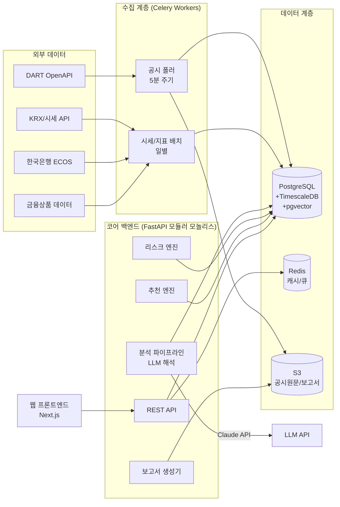
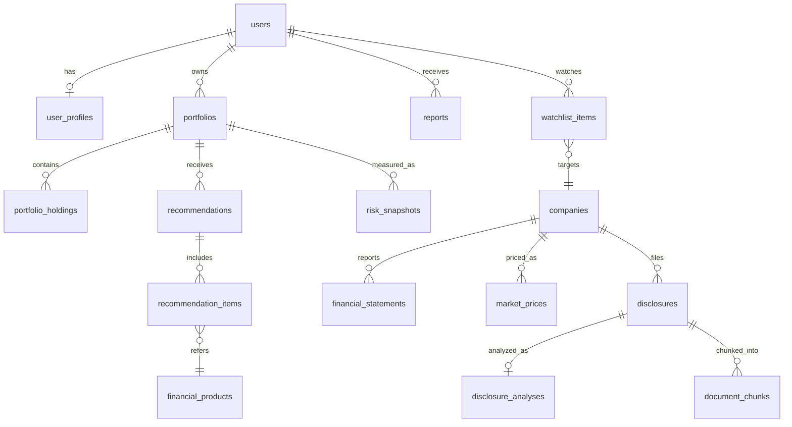
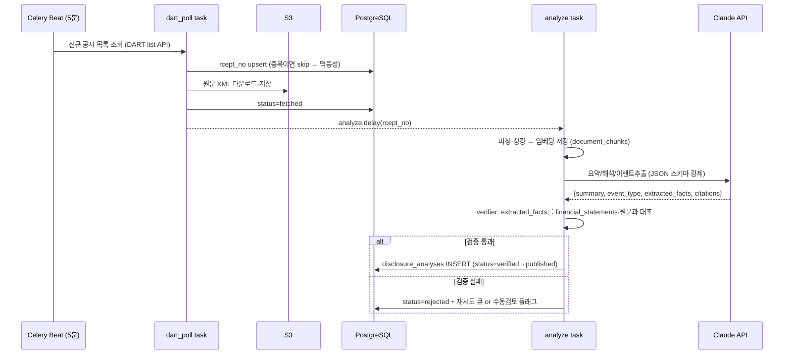

# 투자 인사이트 플랫폼 — 서비스 기획서

> 공시자료 AI 해석 · 개인화 투자 보고서 · 리스크 헤징 금융상품 복합 추천 서비스
> 작성일: 2026-07-16 / 버전: v0.1 (초안)

---

## 1. 서비스 개요

### 1.1 문제 정의
- 개인 투자자는 DART 공시(사업보고서, 주요사항보고 등)를 **읽을 시간도, 해석할 전문성도 부족**하다.
- 정보는 넘치지만 "내 포트폴리오에 어떤 의미인지"를 알려주는 서비스는 드물다.
- 리스크 관리(헤징)는 기관의 영역으로 남아 있고, 개인에게는 실행 가능한 헤징 수단(인버스 ETF, 커버드콜, 달러 자산 등)을 연결해 주는 서비스가 없다.

### 1.2 핵심 가치 제안 (3대 기능)
| # | 기능 | 설명 |
|---|------|------|
| 1 | **공시 해석 데이터** | DART 공시 원문을 수집·파싱하여 LLM 기반으로 요약/해석하고, 재무 수치·이벤트(유상증자, 자사주, 소송 등)를 구조화 데이터로 제공 |
| 2 | **개인화 확신 보고서** | 사용자의 관심 종목/보유 포트폴리오 기준으로 "왜 이 판단이 타당한가"를 근거(공시 원문 인용, 재무 지표)와 함께 정리한 보고서 자동 생성 |
| 3 | **리스크 헤징 상품 복합 추천** | 포트폴리오의 리스크 요인(변동성, 섹터 집중, 환노출 등)을 진단하고, 이를 상쇄할 금융상품 조합(ETF, ELS, 예금, 파생 등)을 적합성 원칙에 맞게 추천 |

### 1.3 타겟 사용자
- 1차: 국내 주식 직접투자 경험 1년 이상, 공시를 "봐야 하는 건 알지만 안 보는" 30~40대 투자자
- 2차: 소규모 자문사/PB — B2B2C 화이트라벨 확장 가능

### 1.4 차별점
- 단순 요약이 아닌 **"수치 검증된 해석"**: LLM 출력의 모든 수치를 원본 공시 데이터와 크로스체크
- 분석 → 보고서 → **실행 가능한 헤징 상품**까지 이어지는 end-to-end 파이프라인
- 모든 추천에 **설명 가능성(explainability)**: "이 상품을 추천한 이유 = 포트폴리오의 X 리스크 상쇄"

---

## 2. 규제·컴플라이언스 검토 (최우선 선행 과제)

> ⚠️ 이 서비스는 기능 구현보다 **법적 지위 결정이 먼저**다. 아래 검토 없이 상품 추천 기능을 오픈하면 자본시장법 위반 소지가 있다.

| 항목 | 내용 | 액션 |
|------|------|------|
| 투자자문업 | 특정인 대상 맞춤 상품 추천은 투자자문업 등록 대상이 될 수 있음 | 법률 자문 → 등록 or 유사투자자문업 신고 or 정보제공 수준으로 기능 조정 |
| 로보어드바이저 테스트베드 | 알고리즘 기반 자문/일임 서비스는 코스콤 RA 테스트베드 통과 필요 | Phase 2 진입 전 테스트베드 일정 확인 |
| 적합성·적정성 원칙 | 금융소비자보호법상 투자성향 진단 후 부적합 상품 추천 금지 | 투자성향 진단 플로우 + 상품별 위험등급 매핑 필수 구현 |
| 데이터 이용 약관 | DART OpenAPI(무료, 출처표기), KRX 시세(재판매 시 라이선스), 한국은행 ECOS | 상용 서비스 전 KRX 데이터 라이선스 계약 검토 |
| 개인정보 | 투자성향·자산 정보는 민감 정보 취급 | 암호화 저장, 최소 수집, 파기 정책 |
| 면책 고지 | "투자 판단의 최종 책임은 투자자에게" 고지 의무 | 모든 보고서/추천 화면에 고지문 |

**MVP 전략**: 초기에는 "투자 정보 제공 + 교육 콘텐츠" 포지션으로 출시(라이선스 불필요)하고, 추천 기능은 "리스크 유형별 상품 카테고리 안내" 수준으로 시작 → 자문업 등록 후 개인화 추천으로 고도화.

---

## 3. 단계별 로드맵

```
Phase 0 (4주)   검증: 규제 검토, 데이터 확보 테스트, 프로토타입(수기 보고서 10건)으로 수요 검증
Phase 1 (12주)  MVP: 공시 수집/해석 파이프라인 + 종목별 해석 데이터 + 기본 보고서
Phase 2 (12주)  확장: 포트폴리오 연동(마이데이터 or 수기입력), 리스크 진단, 카테고리형 헤징 안내
Phase 3 (지속)  고도화: 자문업 등록 후 개인화 상품 추천, B2B API, 실시간 알림
```

### Phase 1 (MVP) 범위 확정
- IN: DART 정기/주요사항 공시 수집, LLM 해석, 종목 페이지, 주간 보고서(이메일/웹), 회원가입
- OUT: 실시간 시세, 매매 연동, 개인화 추천, 모바일 앱 (웹 반응형으로 대체)

---

## 4. 전체 시스템 아키텍처



**설계 원칙**
1. **모듈러 모놀리스로 시작** — 초기 팀(1~4명)에서 마이크로서비스는 운영 부담만 크다. 모듈 경계(ingestion / analysis / risk / recommendation / report)를 코드 레벨에서 엄격히 분리해 두면 추후 서비스 분리 용이.
2. **비동기 우선** — 공시 수집·LLM 분석·보고서 생성은 전부 Celery 비동기 작업. API는 조회 전용에 가깝게 유지.
3. **원본 보존** — 공시 원문(XML/PDF)은 S3에 영구 보존. 파싱/해석 결과가 잘못돼도 재처리 가능.
4. **LLM 출력 불신 원칙** — LLM이 생성한 모든 수치는 DB의 정형 데이터와 대조 검증 후 저장.

---

## 5. 데이터 소스

| 소스 | 데이터 | 방식 | 비용 |
|------|--------|------|------|
| DART OpenAPI | 공시 목록/원문, 정기보고서 재무제표(XBRL) | REST, API키 | 무료 (일 20,000건) |
| KRX 정보데이터시스템 | 종목 마스터, 일별 시세, 지수 | 파일/API | 무료(내부용), 재판매 시 유료 |
| 한국은행 ECOS | 금리, 환율, 거시지표 | REST | 무료 |
| 금융투자협회/금융감독원 | 펀드·ELS·예금 상품 정보 (금융상품 한눈에 API) | REST | 무료 |
| (선택) 증권사 OpenAPI | 실시간 시세, 잔고 연동 | REST/WebSocket | 제휴 필요 |

---

## 6. DB 구성 (상세)

### 6.1 저장소 선택과 역할

| 저장소 | 역할 | 선택 이유 |
|--------|------|-----------|
| **PostgreSQL 16** | 메인 OLTP: 사용자, 기업, 공시 메타, 분석 결과, 상품, 추천 | JSONB·파티셔닝·확장 생태계. 단일 DB로 아래 확장까지 커버 |
| **TimescaleDB (PG 확장)** | 일별/분별 시세, 리스크 스냅샷 시계열 | 하이퍼테이블 자동 파티셔닝, 압축, 시계열 함수. 별도 DB 운영 불필요 |
| **pgvector (PG 확장)** | 공시 문서 청크 임베딩 (검색/RAG) | MVP 규모(수백만 청크)에서 충분. 전용 벡터DB는 과투자 |
| **Redis 7** | API 캐시, 세션, Celery 브로커, rate limit | 표준 |
| **S3 (호환 스토리지)** | 공시 원문(XML/PDF), 생성된 보고서 PDF | 원본 영구 보존, DB 비대화 방지 |

> 원칙: **"하나의 PostgreSQL + 확장"으로 시작**한다. OpenSearch(한국어 전문검색), Kafka, 전용 벡터DB는 트래픽/데이터가 증명될 때 도입한다.

### 6.2 ERD (핵심 엔티티)



### 6.3 스키마 상세 (DDL)

#### A. 사용자 도메인

```sql
CREATE TABLE users (
    id              UUID PRIMARY KEY DEFAULT gen_random_uuid(),
    email           CITEXT UNIQUE NOT NULL,
    password_hash   TEXT,                          -- 소셜 로그인 시 NULL
    auth_provider   TEXT NOT NULL DEFAULT 'email', -- email|google|kakao
    status          TEXT NOT NULL DEFAULT 'active',-- active|suspended|deleted
    created_at      TIMESTAMPTZ NOT NULL DEFAULT now(),
    deleted_at      TIMESTAMPTZ                    -- soft delete (개인정보 파기 배치가 후처리)
);

-- 투자성향: 적합성 원칙 준수의 근거 데이터. 이력 보존 필요 → 갱신 시 새 행 추가
CREATE TABLE user_profiles (
    id                 BIGINT GENERATED ALWAYS AS IDENTITY PRIMARY KEY,
    user_id            UUID NOT NULL REFERENCES users(id),
    risk_grade         SMALLINT NOT NULL CHECK (risk_grade BETWEEN 1 AND 5), -- 1안정형~5공격형
    invest_horizon     TEXT NOT NULL,              -- short|mid|long
    experience_years   SMALLINT,
    survey_answers     JSONB NOT NULL,             -- 설문 원문 응답 (감사 대비 보존)
    assessed_at        TIMESTAMPTZ NOT NULL DEFAULT now(),
    valid_until        DATE NOT NULL               -- 재진단 주기 (통상 1년)
);
CREATE INDEX idx_profiles_user_latest ON user_profiles (user_id, assessed_at DESC);

CREATE TABLE user_consents (               -- 약관/마케팅/데이터 활용 동의 이력
    id          BIGINT GENERATED ALWAYS AS IDENTITY PRIMARY KEY,
    user_id     UUID NOT NULL REFERENCES users(id),
    consent_key TEXT NOT NULL,             -- tos|privacy|marketing|mydata
    granted     BOOLEAN NOT NULL,
    occurred_at TIMESTAMPTZ NOT NULL DEFAULT now()
);
```

#### B. 기업·공시 도메인 (서비스의 심장)

```sql
CREATE TABLE companies (
    id           BIGINT GENERATED ALWAYS AS IDENTITY PRIMARY KEY,
    corp_code    CHAR(8) UNIQUE NOT NULL,   -- DART 고유번호
    stock_code   CHAR(6) UNIQUE,            -- 상장사만. 비상장 NULL
    name_ko      TEXT NOT NULL,
    market       TEXT,                      -- KOSPI|KOSDAQ|KONEX|NULL
    sector_code  TEXT,                      -- KRX 업종코드
    fiscal_month SMALLINT DEFAULT 12,
    is_active    BOOLEAN NOT NULL DEFAULT true,
    updated_at   TIMESTAMPTZ NOT NULL DEFAULT now()
);
CREATE INDEX idx_companies_name_trgm ON companies USING gin (name_ko gin_trgm_ops); -- 종목명 검색

CREATE TABLE disclosures (
    id            BIGINT GENERATED ALWAYS AS IDENTITY,
    rcept_no      CHAR(14) UNIQUE NOT NULL,  -- DART 접수번호 (자연키)
    company_id    BIGINT NOT NULL REFERENCES companies(id),
    report_type   TEXT NOT NULL,             -- A:정기 B:주요사항 C:발행 D:지분 ... (DART 분류)
    report_name   TEXT NOT NULL,             -- "주요사항보고서(유상증자결정)" 등
    filed_at      TIMESTAMPTZ NOT NULL,      -- 접수일시
    raw_file_key  TEXT,                      -- S3 key (원문 XML/PDF)
    ingest_status TEXT NOT NULL DEFAULT 'fetched', -- fetched|parsed|analyzed|failed
    created_at    TIMESTAMPTZ NOT NULL DEFAULT now(),
    PRIMARY KEY (id, filed_at)
) PARTITION BY RANGE (filed_at);             -- 연도별 파티션: 공시는 무한 누적됨
-- 예: CREATE TABLE disclosures_2026 PARTITION OF disclosures
--       FOR VALUES FROM ('2026-01-01') TO ('2027-01-01');
CREATE INDEX idx_disc_company_date ON disclosures (company_id, filed_at DESC);
CREATE INDEX idx_disc_status ON disclosures (ingest_status) WHERE ingest_status <> 'analyzed';

-- LLM 해석 결과: 정형(이벤트 타입/수치)과 비정형(요약문)을 분리 저장
CREATE TABLE disclosure_analyses (
    id                BIGINT GENERATED ALWAYS AS IDENTITY PRIMARY KEY,
    rcept_no          CHAR(14) NOT NULL REFERENCES disclosures(rcept_no),
    model_id          TEXT NOT NULL,          -- 'claude-sonnet-5' 등: 재현성/품질 추적
    prompt_version    TEXT NOT NULL,          -- 프롬프트 버전 관리 (v3 등)
    summary           TEXT NOT NULL,          -- 3~5문장 요약
    interpretation    TEXT NOT NULL,          -- 투자 관점 해석 (긍/부정 요인)
    event_type        TEXT,                   -- capital_increase|buyback|lawsuit|earnings|...
    sentiment         TEXT,                   -- positive|negative|neutral|mixed
    materiality_score SMALLINT CHECK (materiality_score BETWEEN 1 AND 5), -- 중요도
    extracted_facts   JSONB NOT NULL DEFAULT '{}', -- {"증자금액": 50000000000, "발행가": ...}
    verification      JSONB NOT NULL DEFAULT '{}', -- 수치 크로스체크 결과 {"passed": true, ...}
    citations         JSONB NOT NULL DEFAULT '[]', -- 원문 근거 위치 [{"chunk_id":..,"quote":".."}]
    status            TEXT NOT NULL DEFAULT 'draft', -- draft|verified|published|rejected
    created_at        TIMESTAMPTZ NOT NULL DEFAULT now(),
    UNIQUE (rcept_no, prompt_version)
);
CREATE INDEX idx_analyses_event ON disclosure_analyses (event_type, created_at DESC);

-- 재무제표: XBRL에서 추출한 계정과목 단위 정형 데이터 (LLM 수치 검증의 기준점)
CREATE TABLE financial_statements (
    id           BIGINT GENERATED ALWAYS AS IDENTITY PRIMARY KEY,
    company_id   BIGINT NOT NULL REFERENCES companies(id),
    fiscal_year  SMALLINT NOT NULL,
    quarter      SMALLINT NOT NULL CHECK (quarter BETWEEN 1 AND 4),
    consolidated BOOLEAN NOT NULL,            -- 연결/별도
    statement    TEXT NOT NULL,               -- BS|IS|CF
    account_id   TEXT NOT NULL,               -- XBRL 표준계정 ID (ifrs-full_Revenue 등)
    account_name TEXT NOT NULL,
    amount       NUMERIC(20,0) NOT NULL,      -- 원 단위 정수
    rcept_no     CHAR(14) NOT NULL,           -- 출처 공시
    UNIQUE (company_id, fiscal_year, quarter, consolidated, statement, account_id)
);
CREATE INDEX idx_fs_lookup ON financial_statements (company_id, fiscal_year DESC, quarter DESC);

-- 파생 재무비율은 테이블이 아닌 MATERIALIZED VIEW로 (원천 변경 시 일괄 재계산)
CREATE MATERIALIZED VIEW financial_ratios AS
SELECT company_id, fiscal_year, quarter,
       /* ROE, 부채비율, 영업이익률 등 계산식 */ ...
FROM financial_statements GROUP BY 1,2,3;
```

#### C. 시장 데이터 (TimescaleDB)

```sql
CREATE TABLE market_prices (
    company_id BIGINT NOT NULL,
    ts         TIMESTAMPTZ NOT NULL,   -- 일봉이면 장마감 시각
    open  NUMERIC(12,2), high NUMERIC(12,2), low NUMERIC(12,2),
    close NUMERIC(12,2) NOT NULL,
    volume BIGINT,
    PRIMARY KEY (company_id, ts)
);
SELECT create_hypertable('market_prices', 'ts', chunk_time_interval => INTERVAL '1 month');
ALTER TABLE market_prices SET (timescaledb.compress, timescaledb.compress_segmentby='company_id');
SELECT add_compression_policy('market_prices', INTERVAL '3 months'); -- 3개월 지난 청크 압축

CREATE TABLE macro_indicators (          -- 금리/환율/지수
    indicator_code TEXT NOT NULL,        -- KORIBOR3M|USDKRW|KOSPI|...
    ts             TIMESTAMPTZ NOT NULL,
    value          NUMERIC(18,6) NOT NULL,
    PRIMARY KEY (indicator_code, ts)
);
SELECT create_hypertable('macro_indicators', 'ts');
```

#### D. 금융상품 도메인

```sql
-- 공통 속성 + 유형별 상세는 JSONB: 상품 유형마다 스키마가 완전히 달라 정규화 실익 낮음
CREATE TABLE financial_products (
    id             BIGINT GENERATED ALWAYS AS IDENTITY PRIMARY KEY,
    product_type   TEXT NOT NULL,        -- etf|fund|els|deposit|bond|futures_guide
    external_id    TEXT NOT NULL,        -- ISIN/펀드코드 등
    name           TEXT NOT NULL,
    issuer         TEXT,
    risk_grade     SMALLINT NOT NULL CHECK (risk_grade BETWEEN 1 AND 6), -- 금소법 위험등급
    hedge_tags     TEXT[] NOT NULL DEFAULT '{}',
      -- 추천 엔진의 핵심 매핑 키: {'market_down','fx_usd','rate_up','sector_semi','vol_short'}
    attributes     JSONB NOT NULL DEFAULT '{}',  -- 유형별 상세(보수율, 기초자산, 만기 등)
    is_active      BOOLEAN NOT NULL DEFAULT true,
    updated_at     TIMESTAMPTZ NOT NULL DEFAULT now(),
    UNIQUE (product_type, external_id)
);
CREATE INDEX idx_products_hedge ON financial_products USING gin (hedge_tags);
CREATE INDEX idx_products_attrs ON financial_products USING gin (attributes jsonb_path_ops);
```

#### E. 포트폴리오·리스크 도메인

```sql
CREATE TABLE portfolios (
    id         UUID PRIMARY KEY DEFAULT gen_random_uuid(),
    user_id    UUID NOT NULL REFERENCES users(id),
    name       TEXT NOT NULL DEFAULT '기본 포트폴리오',
    source     TEXT NOT NULL DEFAULT 'manual',  -- manual|mydata|broker_api
    created_at TIMESTAMPTZ NOT NULL DEFAULT now()
);

CREATE TABLE portfolio_holdings (
    id           BIGINT GENERATED ALWAYS AS IDENTITY PRIMARY KEY,
    portfolio_id UUID NOT NULL REFERENCES portfolios(id) ON DELETE CASCADE,
    company_id   BIGINT REFERENCES companies(id),  -- 국내주식
    product_id   BIGINT REFERENCES financial_products(id), -- 주식 외 자산
    quantity     NUMERIC(18,6) NOT NULL,
    avg_price    NUMERIC(18,2),
    updated_at   TIMESTAMPTZ NOT NULL DEFAULT now(),
    CHECK (company_id IS NOT NULL OR product_id IS NOT NULL)
);

-- 일별 리스크 스냅샷: 계산 결과를 시계열로 보존 (추천 근거 감사 추적)
CREATE TABLE risk_snapshots (
    portfolio_id UUID NOT NULL,
    ts           TIMESTAMPTZ NOT NULL,
    total_value  NUMERIC(20,0),
    volatility_30d   NUMERIC(8,4),   -- 연환산 변동성
    beta_kospi       NUMERIC(8,4),
    var_95_1d        NUMERIC(20,0),  -- 히스토리컬 VaR (95%, 1일, 원화)
    max_drawdown_1y  NUMERIC(8,4),
    exposures    JSONB NOT NULL,     -- {"sector": {"semi": 0.42,...}, "fx": {"USD": 0.15}, ...}
    risk_flags   TEXT[] NOT NULL DEFAULT '{}', -- {'sector_concentration','high_beta',...}
    PRIMARY KEY (portfolio_id, ts)
);
SELECT create_hypertable('risk_snapshots', 'ts');
```

#### F. 추천·보고서 도메인

```sql
CREATE TABLE recommendations (
    id            UUID PRIMARY KEY DEFAULT gen_random_uuid(),
    portfolio_id  UUID NOT NULL REFERENCES portfolios(id),
    profile_id    BIGINT NOT NULL REFERENCES user_profiles(id), -- 어떤 투자성향 기준이었나
    risk_snapshot_ts TIMESTAMPTZ NOT NULL,   -- 어떤 리스크 진단 기준이었나
    engine_version TEXT NOT NULL,            -- 추천 로직 버전 (감사/재현)
    rationale     TEXT NOT NULL,             -- 종합 추천 사유
    status        TEXT NOT NULL DEFAULT 'generated', -- generated|viewed|dismissed
    created_at    TIMESTAMPTZ NOT NULL DEFAULT now()
);

CREATE TABLE recommendation_items (
    id                BIGINT GENERATED ALWAYS AS IDENTITY PRIMARY KEY,
    recommendation_id UUID NOT NULL REFERENCES recommendations(id) ON DELETE CASCADE,
    product_id        BIGINT NOT NULL REFERENCES financial_products(id),
    target_risk_flag  TEXT NOT NULL,   -- 이 상품이 상쇄하는 리스크
    suggested_weight  NUMERIC(5,4),    -- 제안 비중 (자문업 등록 전엔 NULL)
    reason            TEXT NOT NULL,   -- 항목별 추천 이유 (설명가능성)
    rank              SMALLINT NOT NULL
);

CREATE TABLE reports (
    id          UUID PRIMARY KEY DEFAULT gen_random_uuid(),
    user_id     UUID NOT NULL REFERENCES users(id),
    report_type TEXT NOT NULL,          -- weekly_digest|event_alert|portfolio_review
    title       TEXT NOT NULL,
    body_key    TEXT NOT NULL,          -- S3 key (렌더링된 HTML/PDF)
    input_refs  JSONB NOT NULL,         -- 근거 데이터 참조 {"analyses":[..], "snapshot_ts":..}
    created_at  TIMESTAMPTZ NOT NULL DEFAULT now()
);

CREATE TABLE watchlist_items (
    user_id    UUID NOT NULL REFERENCES users(id),
    company_id BIGINT NOT NULL REFERENCES companies(id),
    created_at TIMESTAMPTZ NOT NULL DEFAULT now(),
    PRIMARY KEY (user_id, company_id)
);
```

#### G. 벡터 검색 (pgvector) + 운영 테이블

```sql
CREATE TABLE document_chunks (
    id         BIGINT GENERATED ALWAYS AS IDENTITY PRIMARY KEY,
    rcept_no   CHAR(14) NOT NULL REFERENCES disclosures(rcept_no),
    chunk_idx  INT NOT NULL,
    section    TEXT,                     -- 공시 내 섹션명
    content    TEXT NOT NULL,
    embedding  vector(1536) NOT NULL,
    UNIQUE (rcept_no, chunk_idx)
);
CREATE INDEX idx_chunks_hnsw ON document_chunks
    USING hnsw (embedding vector_cosine_ops);  -- RAG 근거 검색용

CREATE TABLE job_runs (                  -- 파이프라인 실행 이력 (멱등성/재처리 관리)
    id         BIGINT GENERATED ALWAYS AS IDENTITY PRIMARY KEY,
    job_name   TEXT NOT NULL,            -- dart_poll|price_batch|risk_daily|...
    started_at TIMESTAMPTZ NOT NULL DEFAULT now(),
    finished_at TIMESTAMPTZ,
    status     TEXT NOT NULL DEFAULT 'running',
    stats      JSONB NOT NULL DEFAULT '{}'
);

CREATE TABLE audit_logs (                -- 금융 서비스 필수: 누가 무엇을 언제
    id         BIGINT GENERATED ALWAYS AS IDENTITY,
    user_id    UUID,
    action     TEXT NOT NULL,
    resource   TEXT,
    detail     JSONB,
    occurred_at TIMESTAMPTZ NOT NULL DEFAULT now(),
    PRIMARY KEY (id, occurred_at)
) PARTITION BY RANGE (occurred_at);
```

### 6.4 설계 결정 요약

| 결정 | 이유 |
|------|------|
| `disclosures` 연도별 RANGE 파티셔닝 | 공시는 연 수십만 건 무한 누적. 오래된 파티션은 콜드 스토리지 이동 가능 |
| 분석 결과에 `model_id`/`prompt_version` 저장 | LLM 품질은 프롬프트/모델에 종속. 버전 없이는 품질 회귀 추적 불가 |
| `extracted_facts`/`exposures`는 JSONB | 이벤트 유형·리스크 항목이 계속 늘어남. 스키마 경직성보다 유연성 우선. 단, 조회 키는 반드시 컬럼으로 승격 |
| 재무제표는 계정과목 단위 세로 저장(EAV형) | XBRL 계정이 회사마다 다름. 가로 테이블은 유지 불가 |
| 투자성향·추천에 이력/버전 보존 | 금소법 감사 대응: "그 시점에 왜 그 추천을 했나"를 재현 가능해야 함 |
| soft delete + 파기 배치 | 즉시 물리삭제 대신 참조 무결성 유지 후 개인정보만 비식별화 |

---

## 7. 백엔드 (상세)

### 7.1 기술 스택

| 계층 | 선택 | 이유 |
|------|------|------|
| 언어/런타임 | Python 3.12 | 데이터 파이프라인·수치계산(pandas, numpy)·LLM SDK 생태계가 압도적 |
| 웹 프레임워크 | FastAPI | async 네이티브, Pydantic 검증, OpenAPI 자동 문서화 |
| ORM/마이그레이션 | SQLAlchemy 2.0 + Alembic | 표준. 파티션/확장 기능은 raw SQL 마이그레이션 병행 |
| 비동기 작업 | Celery + Redis (beat 스케줄러) | 폴링/배치/LLM 작업 전부 커버. Kafka는 시기상조 |
| LLM | Claude API (structured output) | 긴 공시 문서 처리, JSON 스키마 강제 출력 |
| 프론트엔드 | Next.js (별도 레포) | SSR로 종목 페이지 SEO 확보 |
| 인프라 | Docker Compose(개발) → AWS ECS Fargate + RDS + ElastiCache + S3 | 운영 인력 최소화 |
| CI/CD | GitHub Actions | 테스트 → 이미지 빌드 → 배포 |

### 7.2 프로젝트 구조 (모듈러 모놀리스)

```
backend/
├── app/
│   ├── api/                    # HTTP 계층 (얇게 유지)
│   │   ├── v1/
│   │   │   ├── auth.py
│   │   │   ├── companies.py
│   │   │   ├── disclosures.py
│   │   │   ├── portfolios.py
│   │   │   ├── recommendations.py
│   │   │   └── reports.py
│   │   └── deps.py             # 인증/DB세션 의존성
│   ├── modules/                # 도메인 모듈 (모듈 간 직접 import 금지, 인터페이스로만)
│   │   ├── ingestion/          # DART/시세 수집
│   │   │   ├── dart_client.py
│   │   │   ├── parser.py       # XML→구조화 텍스트
│   │   │   └── tasks.py        # Celery tasks
│   │   ├── analysis/           # LLM 해석 파이프라인
│   │   │   ├── chunker.py
│   │   │   ├── prompts/        # 버전 관리되는 프롬프트
│   │   │   ├── llm_analyzer.py
│   │   │   ├── verifier.py     # 수치 크로스체크
│   │   │   └── tasks.py
│   │   ├── risk/               # 리스크 엔진
│   │   │   ├── metrics.py      # 변동성/베타/VaR/MDD
│   │   │   ├── exposure.py     # 섹터/환 익스포저
│   │   │   └── tasks.py
│   │   ├── recommendation/     # 추천 엔진
│   │   │   ├── rules.py        # risk_flag → hedge_tag 매핑 규칙
│   │   │   ├── suitability.py  # 적합성 필터 (투자성향 vs 상품등급)
│   │   │   └── engine.py
│   │   └── report/             # 보고서 생성
│   │       ├── composer.py     # 데이터 조립
│   │       ├── templates/      # Jinja2 → HTML/PDF
│   │       └── tasks.py
│   ├── core/                   # 설정, DB, 보안, 로깅
│   └── models/                 # SQLAlchemy 모델
├── alembic/
├── tests/
└── worker/                     # Celery 엔트리포인트
```

### 7.3 핵심 파이프라인 ① — 공시 수집·해석



**구현 포인트**
- **멱등성**: `rcept_no` 유니크 제약으로 중복 수집 방지. 모든 task는 재실행 안전하게 작성.
- **LLM 비용 제어**: `materiality` 사전 필터(단순 신고성 공시는 규칙 기반 처리) → LLM 호출은 주요 공시만. 정기보고서는 섹션별 분할 요약 후 종합.
- **검증(verifier)이 신뢰의 핵심**: LLM이 추출한 금액·비율을 (a) 원문 텍스트 내 존재 여부, (b) XBRL 정형 데이터와 대조. 불일치 시 발행 차단.
- **프롬프트 버전 관리**: `prompts/` 디렉토리를 코드로 관리, 골든셋(수동 검수한 공시 100건)에 대한 회귀 평가를 CI에 포함.

### 7.4 핵심 파이프라인 ② — 리스크 진단 → 헤징 추천

1. **일별 리스크 배치** (`risk_daily`): 포트폴리오별로 250일 수익률 시계열 조회(TimescaleDB) → 변동성·베타·히스토리컬 VaR·MDD·섹터/환 익스포저 계산 → `risk_snapshots` 저장 → 임계치 초과 시 `risk_flags` 부여.
   - 예: 단일 섹터 비중 > 35% → `sector_concentration`, 베타 > 1.3 → `high_beta`, USD 노출 없음 + 수출주 비중 높음 → `fx_unhedged`
2. **추천 엔진** (규칙 기반으로 시작, 이후 최적화 도입):
   - Step 1 — 매핑: `risk_flags` → 필요한 `hedge_tags` (예: `sector_concentration:semi` → `{'sector_diversify','market_down'}`)
   - Step 2 — 후보 조회: `financial_products WHERE hedge_tags && 필요태그 AND is_active`
   - Step 3 — **적합성 필터(필수)**: `product.risk_grade`가 사용자 `user_profiles.risk_grade` 허용 범위 내인 상품만 통과
   - Step 4 — 스코어링: 유동성, 보수율, 추적오차, 상관계수(포트폴리오 수익률과의 음의 상관 우선) 가중합
   - Step 5 — 조합 구성: 리스크 플래그당 1~3개, 전체 3~7개 상품. 각 항목에 `reason` 텍스트 생성
   - 모든 결과는 `engine_version`과 함께 저장 → 감사 추적 가능
3. **Phase 3에서**: 평균-분산 최적화(제안 비중 계산), 협업 필터링 보조 시그널 추가. 단, 설명가능성이 없는 모델은 채택하지 않음.

### 7.5 API 설계 (v1)

| 메서드 | 경로 | 설명 | 인증 |
|--------|------|------|------|
| POST | `/api/v1/auth/signup` `/login` `/refresh` | 이메일/소셜 인증, JWT 발급 | - |
| GET | `/api/v1/companies?q=` | 종목 검색 (trgm) | 선택 |
| GET | `/api/v1/companies/{id}` | 기업 개요 + 최신 재무비율 | 선택 |
| GET | `/api/v1/companies/{id}/disclosures` | 공시 목록 + 해석 요약 (커서 페이지네이션) | 선택 |
| GET | `/api/v1/disclosures/{rcept_no}/analysis` | 공시 해석 상세 (요약/해석/근거 인용) | 필요 |
| GET | `/api/v1/feed` | 관심종목 기반 공시 피드 | 필요 |
| POST | `/api/v1/profiles/assessment` | 투자성향 진단 제출 | 필요 |
| POST/GET | `/api/v1/portfolios` `/holdings` | 포트폴리오 CRUD | 필요 |
| GET | `/api/v1/portfolios/{id}/risk` | 최신 리스크 진단 결과 | 필요 |
| POST | `/api/v1/portfolios/{id}/recommendations` | 헤징 추천 생성 (202 + 비동기) | 필요 |
| GET | `/api/v1/recommendations/{id}` | 추천 결과 조회 | 필요 |
| GET | `/api/v1/reports` `/{id}` | 보고서 목록/상세 (S3 presigned URL) | 필요 |

**API 규약**
- 무거운 작업(추천 생성, 보고서 생성)은 `202 Accepted` + `job_id` 반환 → 폴링 or 웹소켓 알림
- 목록은 전부 커서 기반 페이지네이션 (`?cursor=&limit=`)
- 응답 envelope: `{ "data": ..., "meta": ... }`, 에러는 RFC 9457 problem+json
- 공개 데이터(GET 종목/공시)는 Redis 캐시 60~300초, `Cache-Control` 헤더 병행

### 7.6 인증·보안

- **JWT**: access 15분 + refresh 14일(rotate, Redis 블랙리스트). 소셜 로그인은 OAuth2(카카오/구글).
- **개인정보**: 투자성향·보유내역은 애플리케이션 레벨 암호화 불필요하나(성능), DB는 저장 시 암호화(RDS encryption at rest) + TLS 강제. 이메일 등 식별자는 별도 접근권한.
- **Rate limit**: Redis 기반, 인증 전 IP당/인증 후 user당.
- **감사로그**: 추천 조회·보고서 열람 등 금융 관련 행위는 `audit_logs`에 기록.
- **비밀관리**: AWS Secrets Manager. LLM API 키·DART 키는 코드/환경파일에 두지 않음.

### 7.7 운영·관측성

- **로깅**: structlog JSON → CloudWatch. 요청 ID·job ID 전파.
- **에러**: Sentry (API + worker).
- **메트릭**: Prometheus/Grafana — 공시 수집 지연(접수→발행 소요시간), LLM 검증 실패율, 큐 대기 길이, API p95.
- **알람 기준(예시)**: 수집 지연 > 30분, 검증 실패율 > 5%, 큐 적체 > 500건.
- **테스트 전략**: pytest 단위(리스크 계산은 알려진 값 기반 property test) / API 통합(testcontainers-postgres) / LLM 골든셋 회귀 평가(주기 실행).

---

## 8. 첫 스텝 실행 체크리스트

### Week 1–2 (Phase 0 시작)
- [ ] 법률 자문: 투자자문업/유사투자자문업 해당 여부, MVP 기능 범위 확정
- [ ] DART OpenAPI 키 발급, 공시 목록/원문/XBRL API 호출 테스트
- [ ] 공시 30건 수동 샘플링 → LLM 해석 프롬프트 프로토타이핑 (품질 검증)
- [ ] 수기 제작 보고서 10건으로 잠재 사용자 인터뷰 (수요 검증)

### Week 3–4
- [ ] ERD 확정, PostgreSQL + TimescaleDB + pgvector 로컬 환경 구성 (Docker Compose)
- [ ] 레포 구조 셋업: FastAPI 스켈레톤 + Alembic + CI (lint/test)
- [ ] `ingestion` 모듈: DART 폴러 + 원문 S3 저장 (멱등성 포함) 완성

### Week 5–8
- [ ] `analysis` 모듈: 파싱 → 청킹 → LLM 해석 → verifier 파이프라인
- [ ] 골든셋 100건 구축 + 평가 스크립트
- [ ] 종목/공시 조회 API + 최소 프론트 (종목 페이지)

### Week 9–12
- [ ] 재무제표(XBRL) 적재 + 재무비율 뷰
- [ ] 주간 다이제스트 보고서 (관심종목 기반, 이메일 발송)
- [ ] 클로즈드 베타 오픈 (50~100명)

### Phase 2 진입 조건
- 베타 사용자 주간 리텐션 30% 이상, 해석 품질(수동 평가) 90% 이상 → 포트폴리오/리스크/추천 개발 착수

---

## 9. 리스크 및 열린 질문

1. **규제**: 개인화 추천의 법적 허용 범위 — 법률 자문 결과에 따라 Phase 2/3 설계 변경 가능
2. **LLM 품질**: 공시 해석 오류는 서비스 신뢰도에 치명적 → verifier + 골든셋 + "AI 생성" 고지 3중 방어
3. **데이터 비용**: KRX 시세 재판매 라이선스 비용 — MVP는 일별 종가만 사용해 회피 가능
4. **차별화 지속성**: LLM 요약은 누구나 가능 → 해자는 검증 파이프라인 + 리스크-상품 매핑 데이터에 있음
